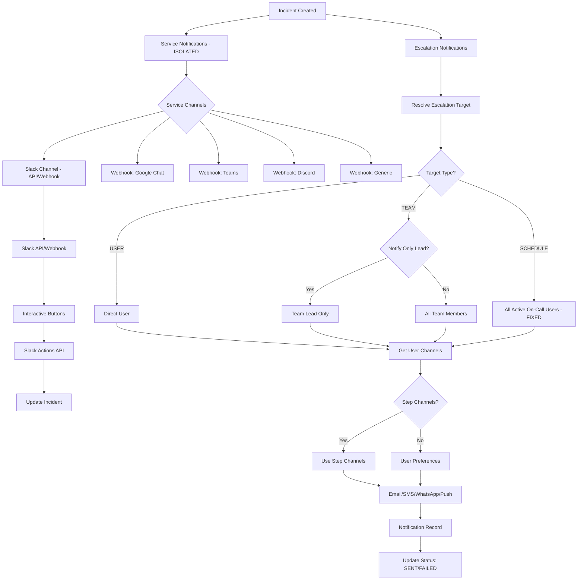

# Comprehensive Notification and Escalation System Enhancement

## Overview

This unified plan addresses all notification and escalation system improvements, including:

1. **Isolating service notifications** from escalation/user preferences
2. **Enhancing Slack integration** with channel selection and interactive buttons
3. **Adding webhook support** for Google Chat, Microsoft Teams, Discord, and other services
4. **Adding team lead functionality** with "notify only team lead" option
5. **Fixing critical escalation bugs** (schedule escalation, service channels)
6. **Adding WhatsApp support** via Twilio
7. **Improving escalation logic** with better error handling and channel configuration

## Critical Issues to Fix

### Issue 1: Schedule Escalation Bug (Critical)

**Problem**: `getOnCallUserForSchedule` only returns the first active on-call user, but schedules can have multiple layers active simultaneously.**Fix**: Return array of all active on-call users from all layers.

### Issue 2: Service Notifications Mixed with User Preferences

**Problem**: Service notifications check user preferences, mixing service-level and user-level logic.**Fix**: Create completely isolated service notification system that uses only service-configured channels.

### Issue 3: Service Notification Channels Missing

**Problem**: `service-notifications.ts` tries to use `service.notificationChannels` but this field doesn't exist in schema.**Fix**: Add `serviceNotificationChannels` field to Service model.

## Implementation Plan

### Phase 1: Schema Updates

#### 1.1 Add Notification Channel Types

**File**: `prisma/schema.prisma`**Changes**:

- Add `WHATSAPP` to `NotificationChannel` enum

#### 1.2 Add Service Notification Configuration

**File**: `prisma/schema.prisma`**Changes**:

- Add `serviceNotificationChannels NotificationChannel[] @default([SLACK, WEBHOOK])` to Service model
- Add `slackChannel String?` to Service model (for channel selection)
- Add `slackWorkspaceId String?` to Service model (for future multi-workspace support)

#### 1.3 Add Webhook Integration Model

**File**: `prisma/schema.prisma`**Changes**:

```prisma
model WebhookIntegration {
  id          String   @id @default(cuid())
  serviceId   String
  name        String   // "Google Chat", "Microsoft Teams", etc.
  type        String   // "GOOGLE_CHAT", "TEAMS", "DISCORD", "GENERIC"
  url         String
  secret      String?  // For HMAC signature
  channel     String?  // Channel/room name
  enabled     Boolean  @default(true)
  createdAt   DateTime @default(now())
  updatedAt   DateTime @updatedAt
  
  service Service @relation(fields: [serviceId], references: [id])
  
  @@index([serviceId])
}
```


#### 1.4 Add Team Lead Functionality

**File**: `prisma/schema.prisma`**Changes**:

- Add `teamLeadId String?` to Team model
- Add relation: `teamLead User? @relation("TeamLead", fields: [teamLeadId], references: [id])`
- Add `teamsLed Team[] @relation("TeamLead")` to User model

#### 1.5 Add Escalation Rule Enhancements

**File**: `prisma/schema.prisma`**Changes**:

- Add `notificationChannels NotificationChannel[]` to EscalationRule (per-step channel config)
- Add `notifyOnlyTeamLead Boolean @default(false)` to EscalationRule

#### 1.6 Add WhatsApp User Preference

**File**: `prisma/schema.prisma`**Changes**:

- Add `whatsappNotificationsEnabled Boolean @default(false)` to User model

### Phase 2: Fix Critical Escalation Bugs

#### 2.1 Fix Schedule Escalation - Notify All Active On-Call Users

**File**: `src/lib/escalation.ts`**Changes**:

- Rename `getOnCallUserForSchedule` → `getOnCallUsersForSchedule` (return array)
- Return all active on-call users from all layers
- Update `resolveEscalationTarget` to handle array of users
- Update all callers to handle multiple users

**Code**:

```typescript
// Before
async function getOnCallUserForSchedule(...): Promise<string | null>

// After
async function getOnCallUsersForSchedule(...): Promise<string[]>
// Returns all active on-call users from all layers
```


#### 2.2 Improve Escalation Error Handling

**File**: `src/lib/escalation.ts`**Changes**:

- Better logging for failed notifications
- Retry logic for schedule resolution failures
- Graceful degradation if on-call user not found
- Handle empty arrays from schedule resolution

### Phase 3: Isolate Service Notifications

#### 3.1 Refactor Service Notifications

**File**: `src/lib/service-notifications.ts` (refactor)**Changes**:

- Remove dependency on user preferences
- Use only service-configured channels (`serviceNotificationChannels`)
- Separate completely from escalation notifications
- Support Slack channels, webhooks, and other service-level channels

**New Architecture**:

```typescript
export async function sendServiceNotifications(
    incidentId: string,
    eventType: 'triggered' | 'acknowledged' | 'resolved' | 'updated'
): Promise<{ success: boolean; errors?: string[] }> {
    // Get service configuration
    // Send to service-configured channels ONLY
    // NO user preference checking
    // NO escalation logic
    // Completely isolated
}
```


#### 3.2 Update Service Notifications to Use Schema Field

**File**: `src/lib/service-notifications.ts`**Changes**:

- Remove type casting workaround
- Use actual schema field: `incident.service.serviceNotificationChannels`
- Add fallback to default channels if not configured

### Phase 4: Slack Integration Enhancements

#### 4.1 Enhance Slack API Support

**File**: `src/lib/slack.ts` (enhance)**Changes**:

- Support both webhook and Slack API
- Add `sendSlackMessageToChannel` function for channel posting
- Use Slack Web API for channel posting
- Support interactive buttons via Block Kit

**New Functions**:

```typescript
// Send to specific channel via Slack API
export async function sendSlackMessageToChannel(
    channel: string,
    incident: IncidentDetails,
    eventType: SlackEventType
): Promise<{ success: boolean; error?: string }>

// Send with interactive buttons
export async function sendSlackInteractiveMessage(
    channel: string,
    incidentId: string,
    eventType: SlackEventType
): Promise<{ success: boolean; error?: string }>
```


#### 4.2 Add Interactive Slack Buttons

**File**: `src/lib/slack.ts`**Implementation**:

- Use Slack Block Kit actions
- Add "Acknowledge" and "Resolve" buttons
- Buttons call API endpoints: `/api/slack/actions?action=ack&incidentId=...`
- Include verification token for security

**Button Payload**:

```json
{
  "type": "actions",
  "elements": [
    {
      "type": "button",
      "text": { "type": "plain_text", "text": "Acknowledge" },
      "style": "primary",
      "value": "ack",
      "action_id": "ack_incident"
    },
    {
      "type": "button",
      "text": { "type": "plain_text", "text": "Resolve" },
      "style": "danger",
      "value": "resolve",
      "action_id": "resolve_incident"
    }
  ]
}
```


#### 4.3 Create Slack Actions API Endpoint

**File**: `src/app/api/slack/actions/route.ts` (new)**Features**:

- Handle Slack interactive button clicks
- Verify Slack request signature
- Update incident status (ack/resolve)
- Send confirmation back to Slack
- Handle errors gracefully

#### 4.4 Create Slack Channels API Endpoint

**File**: `src/app/api/slack/channels/route.ts` (new)**Features**:

- List available Slack channels (for UI dropdown)
- Requires Slack API token
- Cache channel list

### Phase 5: Enhanced Webhook Support

#### 5.1 Add Service-Specific Webhook Formatters

**File**: `src/lib/webhooks.ts` (enhance)**New Functions**:

- `formatGoogleChatPayload()` - Google Chat card format
- `formatMicrosoftTeamsPayload()` - Teams adaptive card
- `formatDiscordPayload()` - Discord embed format
- `formatGenericPayload()` - Generic JSON (existing)

#### 5.2 Update Webhook Sending Logic

**File**: `src/lib/webhooks.ts`**Changes**:

- Detect webhook type from WebhookIntegration
- Use appropriate formatter based on type
- Support multiple webhooks per service

### Phase 6: WhatsApp Integration

#### 6.1 Implement WhatsApp Integration

**File**: `src/lib/whatsapp.ts` (new)**Features**:

- Twilio WhatsApp API integration
- Support for WhatsApp Business API
- Message templates (required by WhatsApp)
- Fallback to SMS if WhatsApp fails
- Delivery tracking

**Implementation**:

```typescript
export async function sendWhatsApp(options: WhatsAppOptions): Promise<{ success: boolean; error?: string }> {
    // Use Twilio WhatsApp API
    // Format: whatsapp:+1234567890
    // Support message templates
}
```


#### 6.2 Update Notification Routing

**File**: `src/lib/notifications.ts`**Changes**:

- Add `WHATSAPP` case in `sendNotification` switch
- Import and use `sendIncidentWhatsApp`

#### 6.3 Add WhatsApp to User Preferences

**Files**:

- `src/components/settings/NotificationPreferencesForm.tsx` - Add WhatsApp checkbox
- `src/lib/user-notifications.ts` - Include WhatsApp in channel check

#### 6.4 Add WhatsApp Provider Configuration

**Files**:

- `src/lib/notification-providers.ts` - Add WhatsApp config
- `src/components/settings/SystemNotificationSettings.tsx` - Add WhatsApp provider UI

### Phase 7: Team Lead Functionality

#### 7.1 Update Escalation Logic for Team Lead

**File**: `src/lib/escalation.ts`**Changes**:

- In `getTeamUsers()`, check if `notifyOnlyTeamLead` is true
- If true, return only team lead ID
- If false or no team lead, return all team members
- Handle case where team has no lead

#### 7.2 Update Team Management UI

**File**: `src/app/(app)/teams/[id]/page.tsx` or team settings**Features**:

- Team lead selector dropdown
- Show current team lead
- Only team owners/admins can set team lead
- Validation: team lead must be a team member

### Phase 8: UI Enhancements

#### 8.1 Service Settings - Notification Configuration

**File**: `src/app/(app)/services/[id]/settings/page.tsx`**Features**:

- **Service Notification Channels** section (isolated):
- Channel selector (SLACK, WEBHOOK, etc.)
- Clear separation: "Service Notifications" vs "Escalation Notifications"

- **Slack Integration**:
- Slack workspace connection (OAuth or token)
- Channel selector dropdown
- Test message button
- Show current channel configuration

- **Webhook Integrations**:
- Add webhook integration button
- Select webhook type (Google Chat, Teams, Discord, Generic)
- Configure URL, secret, channel
- Test webhook button
- List all webhooks for service
- Enable/disable individual webhooks

#### 8.2 Escalation Policy UI

**File**: `src/app/(app)/policies/page.tsx` or policy form**Features**:

- **Per-Step Channel Configuration**:
- Notification channels selector per escalation step
- Override user preferences at step level

- **Team Lead Option**:
- "Notify only team lead" checkbox per step
- Only shown when target type is TEAM

#### 8.3 Team Management UI

**File**: `src/app/(app)/teams/[id]/page.tsx` or team settings**Features**:

- Team lead selector dropdown
- Show current team lead
- Team member management
- Role-based permissions

### Phase 9: Notification Channel Priority and Improvements

#### 9.1 Add Channel Priority System

**File**: `src/lib/user-notifications.ts`**Changes**:

- Priority order: PUSH → SMS → WhatsApp → EMAIL
- Send via highest priority available channel first
- Option to send via all available channels
- Respect user preferences

#### 9.2 Improve Batch Notification Handling

**File**: `src/lib/user-notifications.ts`**Changes**:

- Better error handling for batch sends
- Continue sending even if one channel fails
- Aggregate errors and return summary

## Architecture Diagram




## Files to Create/Modify

### Schema Changes

- `prisma/schema.prisma`:
- Add `WHATSAPP` to `NotificationChannel` enum
- Add `serviceNotificationChannels NotificationChannel[]` to Service
- Add `slackChannel String?` to Service
- Add `slackWorkspaceId String?` to Service
- Add `teamLeadId String?` to Team
- Add `teamsLed Team[]` relation to User
- Add `notifyOnlyTeamLead Boolean` to EscalationRule
- Add `notificationChannels NotificationChannel[]` to EscalationRule
- Add `whatsappNotificationsEnabled Boolean` to User
- Add `WebhookIntegration` model

### Core Logic Files

- `src/lib/service-notifications.ts`:
- Complete refactor - remove user preference logic
- Use only service-configured channels
- Support Slack channels, webhooks
- Completely isolated from escalation
- `src/lib/escalation.ts`:
- Fix schedule escalation (all active users)
- Add team lead support
- Add "notify only team lead" logic
- Improve error handling
- Handle multiple users from schedules
- `src/lib/slack.ts`:
- Add Slack API support (not just webhooks)
- Add interactive buttons
- Add channel posting
- Support both webhook and API methods
- `src/lib/webhooks.ts`:
- Add Google Chat formatter
- Add Microsoft Teams formatter
- Add Discord formatter
- Enhance generic webhook
- Support WebhookIntegration model
- `src/lib/notifications.ts`:
- Add `WHATSAPP` channel routing
- Import WhatsApp sending function
- `src/lib/user-notifications.ts`:
- Add WhatsApp channel support
- Add channel priority logic
- Improve batch notification handling
- Respect escalation step channels

### New Files

- `src/lib/whatsapp.ts` - WhatsApp integration via Twilio
- `src/app/api/slack/actions/route.ts` - Handle Slack button clicks
- `src/app/api/slack/channels/route.ts` - List Slack channels (for UI)

### UI Files

- `src/app/(app)/services/[id]/settings/page.tsx`:
- Service notification channels selector (isolated section)
- Slack channel selector
- Webhook integration management
- Clear separation of service vs escalation notifications
- `src/app/(app)/teams/[id]/page.tsx` or team settings:
- Team lead selector
- Team member management
- `src/app/(app)/policies/page.tsx` or policy form:
- "Notify only team lead" checkbox per step
- Notification channels selector per step
- `src/components/settings/NotificationPreferencesForm.tsx`:
- Add WhatsApp checkbox
- `src/components/settings/SystemNotificationSettings.tsx`:
- Add WhatsApp provider configuration

## Key Design Decisions

1. **Service Notifications Are Completely Isolated**:

- Service notifications use service-configured channels only
- No user preference checking
- No escalation logic
- Completely separate from user/escalation notifications
- Configured at service level, not user level

2. **Slack Integration**:

- Support both webhook and Slack API
- Interactive buttons for ack/resolve
- Channel selection from UI
- Secure button action handling
- Workspace connection support

3. **Webhook Integrations**:

- Service-specific formatters for each platform
- Multiple webhooks per service
- Test functionality for each webhook
- Enable/disable individual webhooks

4. **Team Lead**:

- One team lead per team
- Option to notify only team lead in escalations
- Team lead can be changed by team owners/admins
- Team lead must be a team member

5. **Escalation Step Channels**:

- Each escalation step can specify which channels to use
- Overrides user preferences at step level
- Allows fine-grained control per step

6. **Schedule Escalation**:

- Notifies ALL active on-call users from ALL layers
- Handles multiple simultaneous layers correctly
- Returns array of user IDs, not single user

## Testing Checklist

### Critical Fixes

- [ ] Schedule with single layer notifies correct on-call user
- [ ] Schedule with multiple active layers notifies all on-call users
- [ ] Service notifications work independently of user preferences
- [ ] Service notifications don't affect escalation

### Slack Integration

- [ ] Slack channel selection works
- [ ] Slack interactive buttons work (ack/resolve)
- [ ] Slack API posting works (not just webhooks)
- [ ] Slack button actions update incident correctly

### Webhook Integrations

- [ ] Google Chat webhook sends correctly formatted messages
- [ ] Microsoft Teams webhook sends adaptive cards
- [ ] Discord webhook sends embeds
- [ ] Generic webhook works
- [ ] Multiple webhooks per service work
- [ ] Webhook test functionality works

### Team Lead

- [ ] Team lead selection works
- [ ] "Notify only team lead" option works
- [ ] Team escalation notifies all members when lead option is false
- [ ] Team escalation notifies only lead when option is true

### WhatsApp

- [ ] WhatsApp notifications work via Twilio
- [ ] Fallback to SMS if WhatsApp fails
- [ ] WhatsApp user preference works
- [ ] WhatsApp provider configuration works

### Escalation

- [ ] Team escalation notifies all team members (when not lead-only)
- [ ] User escalation notifies single user
- [ ] Escalation step channels override user preferences
- [ ] Error handling for missing on-call users
- [ ] Error handling for invalid schedule configurations

## Migration Steps

1. Run Prisma migration for all schema changes
2. Update existing services with default `serviceNotificationChannels`
3. Update existing escalation rules with default `notificationChannels`
4. Set default team leads (optional, can be done manually)
5. Test escalation flow with all target types
6. Test service notifications isolation
7. Test Slack integration
8. Test webhook integrations