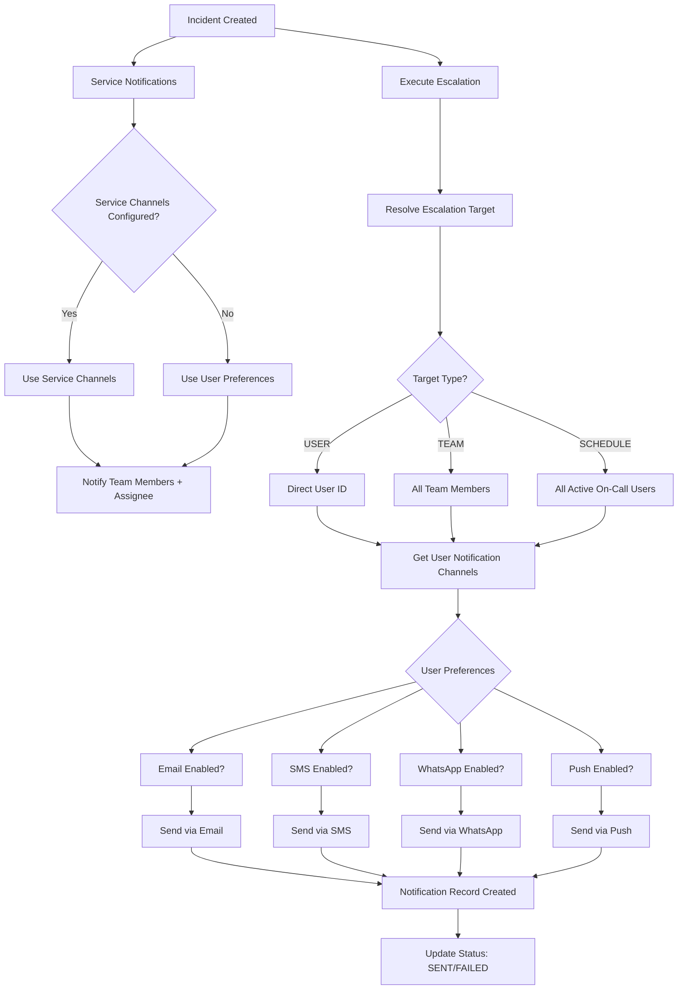

#Notification and Escalation Logic Review and Enhancement Plan

## Current Flow Analysis

### Escalation Flow (When Incident Created)

1. Incident created → `createIncident` action
2. Calls `sendServiceNotifications` (notifies team members + assignee)
3. Calls `executeEscalation` (executes escalation policy steps)
4. `executeEscalation` resolves targets:

- **USER**: Direct user ID
- **TEAM**: All team members (✅ correct)
- **SCHEDULE**: Only first on-call user (❌ **BUG** - should notify all active layers)

### Issues Identified

#### 1. Schedule Escalation Bug (Critical)

**Problem**: `getOnCallUserForSchedule` only returns the first active block, but schedules can have multiple layers active simultaneously (e.g., "day" and "night" layers).**Current Code** (`src/lib/escalation.ts:72-77`):

```typescript
const activeBlock = blocks.find(block => 
    block.start.getTime() <= atTime.getTime() && 
    block.end.getTime() > atTime.getTime()
);
return activeBlock?.userId || null; // Only returns ONE user
```

**Fix**: Return all active on-call users from all layers.

#### 2. Service Notification Channels Missing (Critical)

**Problem**: `service-notifications.ts` tries to use `service.notificationChannels` but this field doesn't exist in the schema.**Current Code** (`src/lib/service-notifications.ts:43`):

```typescript
const serviceNotificationChannels = (incident.service as { notificationChannels?: NotificationChannel[] }).notificationChannels;
```

**Fix**: Add `notificationChannels` field to Service model in schema.

#### 3. WhatsApp Support Missing

**Problem**: No WhatsApp channel support. Twilio supports WhatsApp via their API.**Fix**: Add `WHATSAPP` channel type and implement Twilio WhatsApp API integration.

#### 4. Service-Level Channel Configuration Missing

**Problem**: Services can't configure which channels to use (currently only Slack webhook URL).**Fix**: Add service settings UI to configure notification channels.

## Implementation Plan

### Phase 1: Fix Critical Bugs

#### 1.1 Fix Schedule Escalation - Notify All Active On-Call Users

**File**: `src/lib/escalation.ts`**Changes**:

- Rename `getOnCallUserForSchedule` to `getOnCallUsersForSchedule` (plural)
- Return array of user IDs instead of single user
- Update `resolveEscalationTarget` to handle multiple users
- Update all callers

**Code Changes**:

```typescript
// Before
async function getOnCallUserForSchedule(...): Promise<string | null>

// After  
async function getOnCallUsersForSchedule(...): Promise<string[]>
// Returns all active on-call users from all layers
```


#### 1.2 Add Service Notification Channels to Schema

**File**: `prisma/schema.prisma`**Changes**:

- Add `notificationChannels NotificationChannel[] @default([EMAIL, SLACK])` to Service model
- Create migration

#### 1.3 Fix Service Notifications to Use Schema Field

**File**: `src/lib/service-notifications.ts`**Changes**:

- Remove type casting workaround
- Use actual schema field: `incident.service.notificationChannels`
- Add fallback to user preferences if service channels not configured

### Phase 2: Add WhatsApp Support

#### 2.1 Add WhatsApp Channel Type

**Files**:

- `prisma/schema.prisma` - Add `WHATSAPP` to `NotificationChannel` enum
- `src/lib/notifications.ts` - Add `WHATSAPP` to type

#### 2.2 Implement Twilio WhatsApp Integration

**File**: `src/lib/whatsapp.ts` (new)**Features**:

- Twilio WhatsApp API integration
- Support for WhatsApp Business API
- Message templates (required by WhatsApp)
- Fallback to SMS if WhatsApp fails

**Implementation**:

```typescript
export async function sendWhatsApp(options: WhatsAppOptions): Promise<{ success: boolean; error?: string }> {
    // Use Twilio WhatsApp API
    // Format: whatsapp:+1234567890
    // Support message templates
}
```


#### 2.3 Update Notification Routing

**File**: `src/lib/notifications.ts`**Changes**:

- Add `WHATSAPP` case in `sendNotification` switch
- Import and use `sendIncidentWhatsApp`

#### 2.4 Add WhatsApp to User Preferences

**Files**:

- `prisma/schema.prisma` - Add `whatsappNotificationsEnabled Boolean @default(false)` to User
- `src/components/settings/NotificationPreferencesForm.tsx` - Add WhatsApp checkbox
- `src/lib/user-notifications.ts` - Include WhatsApp in channel check

#### 2.5 Add WhatsApp Provider Configuration

**Files**:

- `src/lib/notification-providers.ts` - Add WhatsApp config
- `src/components/settings/SystemNotificationSettings.tsx` - Add WhatsApp provider UI

### Phase 3: Service-Level Notification Channels

#### 3.1 Service Settings UI

**File**: `src/app/(app)/services/[id]/settings/page.tsx`**Changes**:

- Add notification channels selector
- Allow admins to configure which channels service uses
- Show current configuration

#### 3.2 Update Service Notifications Logic

**File**: `src/lib/service-notifications.ts`**Changes**:

- Use service's `notificationChannels` from database
- Respect user preferences (only send via channels user enabled)
- Fallback logic: service channels → user preferences → default

### Phase 4: Enhancements and Improvements

#### 4.1 Improve Escalation Error Handling

**File**: `src/lib/escalation.ts`**Changes**:

- Better logging for failed notifications
- Retry logic for schedule resolution failures
- Graceful degradation if on-call user not found

#### 4.2 Add Notification Channel Priority

**File**: `src/lib/user-notifications.ts`**Changes**:

- Priority order: PUSH → SMS → WhatsApp → EMAIL
- Send via highest priority available channel first
- Option to send via all available channels

#### 4.3 Add Escalation Step Channel Configuration

**File**: `prisma/schema.prisma`**Changes**:

- Add `notificationChannels NotificationChannel[]` to `EscalationRule`
- Allow each escalation step to specify which channels to use
- Override user preferences at escalation step level

#### 4.4 Improve Team Notification Logic

**File**: `src/lib/escalation.ts`**Changes**:

- Add option to notify all team members or just team lead
- Support for team notification preferences

#### 4.5 Add Notification Delivery Confirmation

**Enhancement**: Track delivery status for all channels

- Email: Track opens/clicks (if using Resend/SendGrid)
- SMS: Track delivery receipts (Twilio)
- WhatsApp: Track read receipts (Twilio)
- Push: Track delivery status (Firebase/OneSignal)

## Architecture Diagram




## Files to Modify

### Schema Changes

- `prisma/schema.prisma`:
- Add `WHATSAPP` to `NotificationChannel` enum
- Add `notificationChannels NotificationChannel[]` to `Service` model
- Add `whatsappNotificationsEnabled Boolean` to `User` model
- Add `notificationChannels NotificationChannel[]` to `EscalationRule` model

### Core Logic Files

- `src/lib/escalation.ts`:
- Fix `getOnCallUserForSchedule` → `getOnCallUsersForSchedule` (return array)
- Update `resolveEscalationTarget` to handle multiple users
- Improve error handling and logging
- `src/lib/service-notifications.ts`:
- Fix to use actual schema field
- Add fallback logic
- Respect user preferences
- `src/lib/user-notifications.ts`:
- Add WhatsApp channel support
- Add channel priority logic
- Improve batch notification handling
- `src/lib/notifications.ts`:
- Add `WHATSAPP` channel routing
- Import WhatsApp sending function

### New Files

- `src/lib/whatsapp.ts`:
- Twilio WhatsApp API integration
- Message template support
- Delivery tracking

### UI Files

- `src/components/settings/NotificationPreferencesForm.tsx`:
- Add WhatsApp checkbox
- Update phone number field to support WhatsApp
- `src/app/(app)/services/[id]/settings/page.tsx`:
- Add notification channels selector
- Service-level channel configuration UI
- `src/components/settings/SystemNotificationSettings.tsx`:
- Add WhatsApp provider configuration
- `src/app/(app)/policies/page.tsx` or policy form:
- Add notification channels selector per escalation step

## Testing Checklist

- [ ] Schedule with single layer notifies correct on-call user
- [ ] Schedule with multiple active layers notifies all on-call users
- [ ] Team escalation notifies all team members
- [ ] User escalation notifies single user
- [ ] Service-level channels override user preferences
- [ ] WhatsApp notifications work via Twilio
- [ ] Fallback to SMS if WhatsApp fails
- [ ] Escalation step channels override service/user preferences
- [ ] Error handling for missing on-call users
- [ ] Error handling for invalid schedule configurations

## Recommendations

### High Priority

1. **Fix schedule escalation bug** - Currently only notifies first on-call user
2. **Add service notification channels** - Services need channel configuration
3. **Add WhatsApp support** - Critical for global teams

### Medium Priority

4. **Escalation step channel configuration** - Fine-grained control
5. **Notification priority system** - Send via best available channel first
6. **Delivery confirmation tracking** - Better visibility

### Low Priority

7. **Team notification preferences** - Team-level overrides
8. **Notification templates** - Customizable messages per channel
9. **Quiet hours** - Don't notify during specified hours
10. **Notification digests** - Batch notifications

## Migration Steps

1. Run Prisma migration for schema changes
2. Update existing services with default notification channels
3. Update existing escalation rules with default channels
4. Test escalation flow with all target types