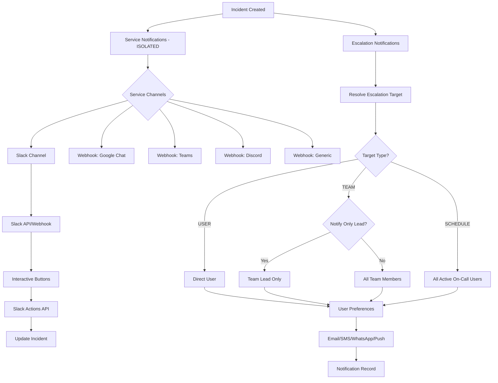

# Notification System Isolation and Integration Enhancements

## Key Requirements

1. **Service notifications must be completely isolated** - No impact on escalation or user preferences
2. **Slack enhancements** - Channel selection, interactive buttons (ack/resolve), UI improvements
3. **Webhook support** - Google Chat, Microsoft Teams, Discord, and other services
4. **Team lead functionality** - Add team lead selection and "notify only team lead" option

## Current Architecture Issues

### Issue 1: Service Notifications Mixed with User Preferences

**Problem**: `sendServiceNotifications` in `user-notifications.ts` uses user preferences, which mixes service-level and user-level logic.**Current Flow**:

- Service notifications check user preferences
- This creates confusion between service-level and escalation-level notifications

**Solution**: Create completely separate service notification system that:

- Uses service-configured channels only
- Does NOT check user preferences
- Sends to service-configured destinations (Slack channel, webhooks, etc.)

### Issue 2: Slack Channel Selection Missing

**Problem**: Currently only webhook URL, no channel selection.**Solution**:

- Add `slackChannel` field to Service model
- Add Slack workspace/channel selector UI
- Support Slack API (not just webhooks) for channel posting

### Issue 3: Slack Interactive Buttons Missing

**Problem**: Slack messages don't have interactive buttons for ack/resolve.**Solution**: Add Slack Block Kit interactive buttons that call back to API endpoints.

### Issue 4: Webhook Support Limited

**Problem**: Only generic webhook, no specific integrations for Google Chat, Teams, etc.**Solution**: Add specific webhook integrations with proper payload formatting for each service.

### Issue 5: Team Lead Missing

**Problem**: No team lead concept, can't notify only team lead.**Solution**: Add `teamLeadId` to Team model and support "notify only team lead" option.

## Implementation Plan

### Phase 1: Isolate Service Notifications

#### 1.1 Create Separate Service Notification System

**File**: `src/lib/service-notifications.ts` (refactor)**Changes**:

- Remove dependency on user preferences
- Use only service-configured channels
- Separate from escalation notifications completely

**New Architecture**:

```typescript
// Service notifications are independent
export async function sendServiceNotifications(
    incidentId: string,
    eventType: 'triggered' | 'acknowledged' | 'resolved' | 'updated'
): Promise<{ success: boolean; errors?: string[] }> {
    // Get service configuration
    // Send to service-configured channels ONLY
    // NO user preference checking
    // NO escalation logic
}
```


#### 1.2 Add Service Notification Channels to Schema

**File**: `prisma/schema.prisma`**Changes**:

- Add `serviceNotificationChannels NotificationChannel[] @default([SLACK, WEBHOOK])` to Service
- This is separate from escalation channels

#### 1.3 Update Service Settings UI

**File**: `src/app/(app)/services/[id]/settings/page.tsx`**Changes**:

- Add service notification channels selector
- Show clear separation: "Service Notifications" vs "Escalation Notifications"
- Configure Slack channel, webhooks, etc. at service level

### Phase 2: Slack Integration Enhancements

#### 2.1 Add Slack Channel to Service Model

**File**: `prisma/schema.prisma`**Changes**:

- Add `slackChannel String?` to Service model
- Add `slackWorkspaceId String?` for future multi-workspace support

#### 2.2 Implement Slack API Integration (Not Just Webhooks)

**File**: `src/lib/slack.ts` (enhance)**Changes**:

- Support both webhook and Slack API
- Add `sendSlackMessageToChannel` function
- Use Slack Web API for channel posting
- Support interactive buttons via Block Kit

**New Functions**:

```typescript
// Send to specific channel via Slack API
export async function sendSlackMessageToChannel(
    channel: string,
    incident: IncidentDetails,
    eventType: SlackEventType
): Promise<{ success: boolean; error?: string }>

// Send with interactive buttons
export async function sendSlackInteractiveMessage(
    channel: string,
    incidentId: string,
    eventType: SlackEventType
): Promise<{ success: boolean; error?: string }>
```


#### 2.3 Add Interactive Slack Buttons

**File**: `src/lib/slack.ts`**Implementation**:

- Use Slack Block Kit actions
- Add "Acknowledge" and "Resolve" buttons
- Buttons call API endpoints: `/api/slack/actions?action=ack&incidentId=...`
- Include verification token for security

**Button Payload**:

```json
{
  "type": "actions",
  "elements": [
    {
      "type": "button",
      "text": { "type": "plain_text", "text": "Acknowledge" },
      "style": "primary",
      "value": "ack",
      "action_id": "ack_incident"
    },
    {
      "type": "button",
      "text": { "type": "plain_text", "text": "Resolve" },
      "style": "danger",
      "value": "resolve",
      "action_id": "resolve_incident"
    }
  ]
}
```


#### 2.4 Create Slack Actions API Endpoint

**File**: `src/app/api/slack/actions/route.ts` (new)**Features**:

- Handle Slack interactive button clicks
- Verify Slack request signature
- Update incident status (ack/resolve)
- Send confirmation back to Slack

#### 2.5 Add Slack Channel Selector UI

**File**: `src/app/(app)/services/[id]/settings/page.tsx`**Features**:

- Slack workspace connection (OAuth or token)
- Channel selector dropdown
- Test message button
- Show current channel configuration

### Phase 3: Enhanced Webhook Support

#### 3.1 Add Webhook Service Types

**File**: `prisma/schema.prisma`**Changes**:

- Create `WebhookIntegration` model:
  ```prisma
      model WebhookIntegration {
        id          String   @id @default(cuid())
        serviceId   String
        name        String   // "Google Chat", "Microsoft Teams", etc.
        type        String   // "GOOGLE_CHAT", "TEAMS", "DISCORD", "GENERIC"
        url         String
        secret      String?  // For HMAC signature
        channel     String?  // Channel/room name
        enabled     Boolean  @default(true)
        createdAt   DateTime @default(now())
        updatedAt   DateTime @updatedAt
        
        service Service @relation(fields: [serviceId], references: [id])
        
        @@index([serviceId])
      }
  ```


#### 3.2 Create Service-Specific Webhook Formatters

**File**: `src/lib/webhooks.ts` (enhance)**New Functions**:

- `formatGoogleChatPayload()` - Google Chat card format
- `formatMicrosoftTeamsPayload()` - Teams adaptive card
- `formatDiscordPayload()` - Discord embed format
- `formatGenericPayload()` - Generic JSON (existing)

#### 3.3 Add Webhook Integration UI

**File**: `src/app/(app)/services/[id]/settings/page.tsx`**Features**:

- Add webhook integration button
- Select webhook type (Google Chat, Teams, Discord, Generic)
- Configure URL, secret, channel
- Test webhook button
- List all webhooks for service

### Phase 4: Team Lead Functionality

#### 4.1 Add Team Lead to Schema

**File**: `prisma/schema.prisma`**Changes**:

- Add `teamLeadId String?` to Team model
- Add relation: `teamLead User? @relation("TeamLead", fields: [teamLeadId], references: [id])`
- Add `teamsLed Team[] @relation("TeamLead")` to User model

#### 4.2 Update Team Management UI

**File**: `src/app/(app)/teams/[id]/page.tsx` or team settings**Features**:

- Team lead selector dropdown
- Show current team lead
- Only team owners/admins can set team lead

#### 4.3 Add "Notify Only Team Lead" Option

**File**: `prisma/schema.prisma`**Changes**:

- Add `notifyOnlyTeamLead Boolean @default(false)` to EscalationRule
- When true, only notify team lead instead of all team members

#### 4.4 Update Escalation Logic

**File**: `src/lib/escalation.ts`**Changes**:

- In `getTeamUsers()`, check if `notifyOnlyTeamLead` is true
- If true, return only team lead ID
- If false or no team lead, return all team members

### Phase 5: Fix Schedule Escalation Bug

#### 5.1 Fix Multiple On-Call Users

**File**: `src/lib/escalation.ts`**Changes**:

- Rename `getOnCallUserForSchedule` → `getOnCallUsersForSchedule`
- Return array of all active on-call users from all layers
- Update `resolveEscalationTarget` to handle array

### Phase 6: Add WhatsApp Support

#### 6.1 Add WhatsApp Channel

**File**: `prisma/schema.prisma`

- Add `WHATSAPP` to `NotificationChannel` enum

#### 6.2 Implement WhatsApp Integration

**File**: `src/lib/whatsapp.ts` (new)

- Twilio WhatsApp API integration
- Message template support

## Architecture Diagram




## Files to Create/Modify

### Schema Changes

- `prisma/schema.prisma`:
- Add `serviceNotificationChannels NotificationChannel[]` to Service
- Add `slackChannel String?` to Service
- Add `teamLeadId String?` to Team
- Add `notifyOnlyTeamLead Boolean` to EscalationRule
- Add `WebhookIntegration` model
- Add `WHATSAPP` to NotificationChannel enum

### Core Logic

- `src/lib/service-notifications.ts`:
- Complete refactor - remove user preference logic
- Use only service-configured channels
- Support Slack channels, webhooks
- `src/lib/slack.ts`:
- Add Slack API support (not just webhooks)
- Add interactive buttons
- Add channel posting
- `src/lib/escalation.ts`:
- Fix schedule escalation (all active users)
- Add team lead support
- Add "notify only team lead" logic
- `src/lib/webhooks.ts`:
- Add Google Chat formatter
- Add Microsoft Teams formatter
- Add Discord formatter
- Enhance generic webhook

### New Files

- `src/lib/whatsapp.ts` - WhatsApp integration
- `src/app/api/slack/actions/route.ts` - Handle Slack button clicks
- `src/app/api/slack/channels/route.ts` - List Slack channels (for UI)

### UI Files

- `src/app/(app)/services/[id]/settings/page.tsx`:
- Service notification channels selector
- Slack channel selector
- Webhook integration management
- `src/app/(app)/teams/[id]/page.tsx` or team settings:
- Team lead selector
- Team member management
- `src/app/(app)/policies/page.tsx` or policy form:
- "Notify only team lead" checkbox per step

## Key Design Decisions

1. **Service Notifications Are Isolated**:

- Service notifications use service-configured channels only
- No user preference checking
- No escalation logic
- Completely separate from user/escalation notifications

2. **Slack Integration**:

- Support both webhook and Slack API
- Interactive buttons for ack/resolve
- Channel selection from UI
- Secure button action handling

3. **Webhook Integrations**:

- Service-specific formatters for each platform
- Multiple webhooks per service
- Test functionality for each webhook

4. **Team Lead**:

- One team lead per team
- Option to notify only team lead in escalations
- Team lead can be changed by team owners/admins

## Testing Checklist

- [ ] Service notifications work independently of user preferences
- [ ] Service notifications don't affect escalation
- [ ] Slack channel selection works
- [ ] Slack interactive buttons work (ack/resolve)
- [ ] Google Chat webhook sends correctly formatted messages
- [ ] Microsoft Teams webhook sends adaptive cards
- [ ] Discord webhook sends embeds
- [ ] Team lead selection works
- [ ] "Notify only team lead" option works