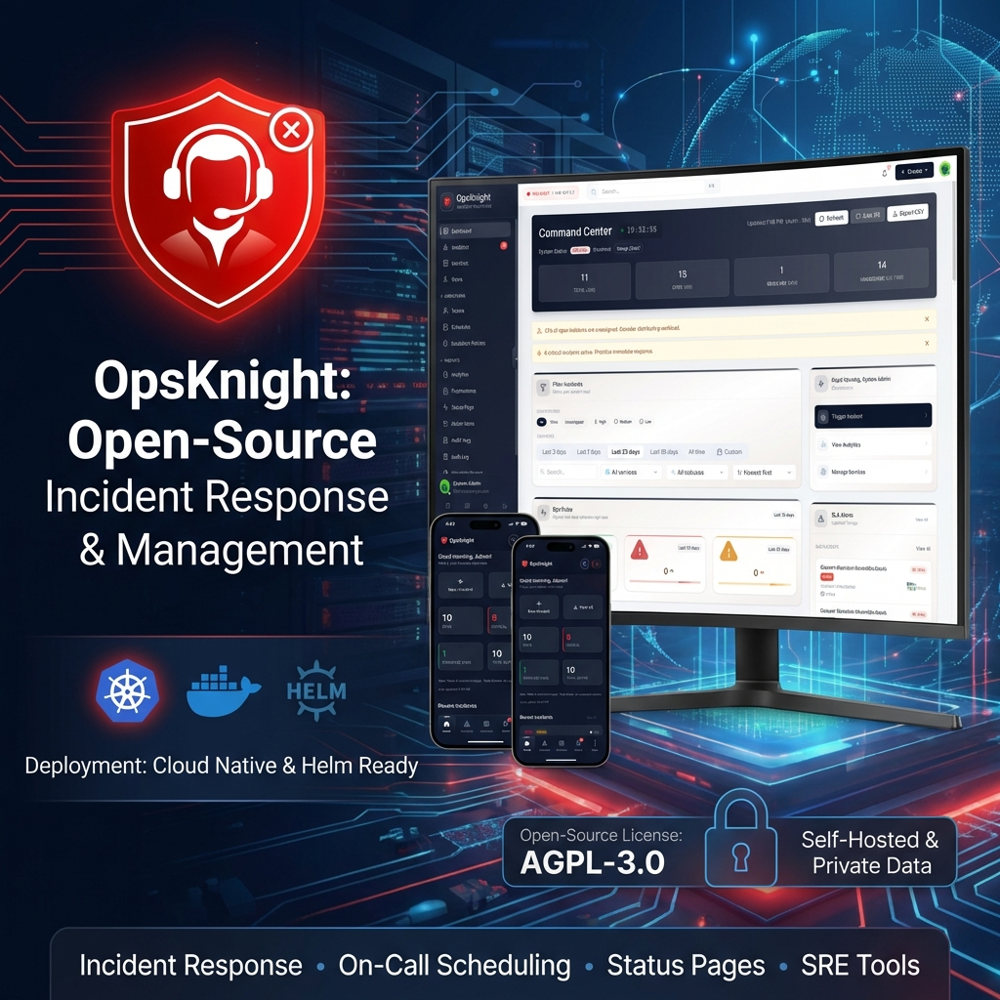

<div align="center">



# 🛡️ OpsKnight

**Open-Source Incidents, On-Call, and Status Pages.**

[](https://opsknight.com)
[](LICENSE)
[](docs/deployment/docker-compose.md)
[](docs/deployment/helm.md)

<div align="center">
  <h3>
    <a href="https://opsknight.com" target="_blank">
      🌐 Visit Website: opsknight.com
    </a>
  </h3>
</div>

[**Documentation**](docs/) • [**Live Demo**](https://opsknight.com) • [**Join Community**](https://discord.gg/opsknight)

</div>

---

## 🚀 Overview

**OpsKnight** is the open-source alternative to PagerDuty and OpsGenie. We help engineering teams manage on-call rotations, escalate alerts, and communicate incidents effectively—without the enterprise price tag.

### ✨ Key Features

- **🚨 Incident Management** - Full lifecycle tracking, severity levels, and automated timelines.
- **📅 On-Call Scheduling** - Flexible rotations, layers, overrides, and fair-scheduling algorithms.
- **📈 Escalation Policies** - Ensure no alert is missed with multi-step escalation rules.
- **🌐 Status Pages** - Beautiful public-facing status pages with subscriber notifications.
- **🔔 Omni-Channel Alerts** - Native integrations for Slack, SMS, Phone, Email, and Push.
- **📱 Mobile App** - Full-featured PWA for iOS and Android.

---

## 📦 Deployment

OpsKnight is designed to run anywhere. Choose your preferred deployment method:

### 🐳 Docker Compose (Fastest)

Ideal for testing and small deployments.

```bash
git clone https://github.com/dushyant-rahangdale/opsknight.git
cd opsknight
cp env.example .env
docker compose up -d
```

### ☸️ Helm Charts

Production-ready Kubernetes deployment.

```bash
helm repo add opsknight https://charts.opsknight.com
helm install opsknight opsknight/opsknight -n opsknight --create-namespace
```

### ⛵ Kustomize

For declarative Kubernetes management.

```bash
kubectl apply -k deploy/kustomize/overlays/production
```

> See [**Deployment Documentation**](docs/deployment/) for detailed configuration guides.

---

## 📚 Documentation Portal

Everything you need to build, deploy, and manage OpsKnight.

### 🏁 Getting Started

- [**Installation Guide**](docs/getting-started/README.md) - Set up OpsKnight in minutes.
- [**Configuration**](docs/getting-started/configuration.md) - Environment variables and secrets.
- [**Core Concepts**](docs/core-concepts/README.md) - detailed overview of the platform model.

### 🛠️ Operator Manual

- [**Deployment**](docs/deployment/README.md) - Guides for Docker, Helm, and Kustomize.
  - [Docker Compose](docs/deployment/docker-compose.md)
  - [Helm Charts](docs/deployment/helm.md)
  - [Kustomize](docs/deployment/kustomize.md)
- [**Administration**](docs/administration/README.md) - Manage users, roles, and SSO.
- [**Security**](docs/security/README.md) - Hardening and compliance.

### 👨‍💻 Developer Resources

- [**API Reference**](docs/api/README.md) - Automate everything with our REST API.
- [**Integrations**](docs/integrations/README.md) - Connect Slack, Datadog, Prometheus, and more.
- [**Contributing**](CONTRIBUTING.md) - strict guidelines for code contributions.

---

## 🔌 Integrations

Native support for your favorite observability tools:

<p align="center">
  
  
  
  
  
  
</p>

---

## 🤝 Contributing

We love contributions! OpsKnight is built by the community, for the community.

1.  Read our [**Contributing Guide**](CONTRIBUTING.md).
2.  Join our [Discord](https://discord.gg/opsknight) to discuss ideas.
3.  Open a Pull Request!

## 📄 License

Licensed under the [Apache License 2.0](LICENSE).

<div align="center">
  <sub>Built with ❤️ for SREs and DevOps Teams</sub>
</div>
