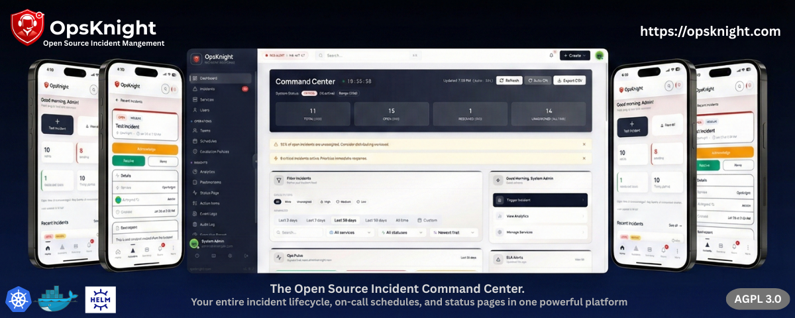

<div align="center">



# OpsKnight

**The Open Source Incident Command Center.**<br>
_Your entire incident lifecycle, on-call schedules, and status pages in one powerful platform._

[**opsknight.com**](https://opsknight.com)

[](https://opsknight.com)
[](https://opsknight.com/docs)
[](LICENSE)
[](docs/v1/deployment/docker.md)
[](ROADMAP.md)
[](https://github.com/sponsors/dushyant-rahangdale)
[](https://github.com/dushyant-rahangdale/opsknight/actions/workflows/tests.yml)
[](https://github.com/dushyant-rahangdale/opsknight/actions/workflows/security.yml)

<br>

</div>

---

</div>

---

## 📑 Table of Contents

- [Why OpsKnight?](#-why-opsknight)
- [Key Features](#-key-features)
- [Mobile Command Center](#-mobile-command-center)
- [Built With](#-built-with)
- [Quick Start](#-quick-start)
- [Deployment Options](#-deployment-options)
- [Architecture](#-architecture)
- [Documentation](#-documentation)
- [Roadmap](#-roadmap)
- [Community & Support](#-community--support)

---

## ⚡ Why OpsKnight?

**Stop paying per-seat for reliability.**

OpsKnight is the open-source alternative to PagerDuty and OpsGenie, designed for teams that want full control over their incident management stack without the massive SaaS bill. From the first alert to the final post-mortem, OpsKnight unifies your entire reliability workflow into a single, cohesive developer experience.

Whether you are an SRE team at a startup maintaining 99.99% uptime or a Platform Engineer at a large enterprise, OpsKnight gives you the tools to **detect, respond, and resolve** faster.

| Feature             |        OpsKnight 🛡️         |   Proprietary SaaS 💸    |
| :------------------ | :-------------------------: | :----------------------: |
| **Hosting**         | Self-Hosted / Private Cloud |    Public Cloud Only     |
| **Cost**            |     Free (Open Source)      | $20-$100 / user / month  |
| **Users**           |        **Unlimited**        |     Per-Seat Pricing     |
| **Status Pages**    |  **Included (Unlimited)**   |        Extra Cost        |
| **Custom Branding** |       ✅ Full Control       |        ❌ Limited        |
| **Data Privacy**    |    ✅ 100% Owned by You     | ❌ Third-Party Processed |


---

## 🎥 Demo

<div align="center">
  
</div>

---

## ✨ Key Features

<table>
  <tr>
    <td width="50%">
      <h3>🚨 Unified Command Center</h3>
      <p>Manage incidents, responders, and runbooks from a single real-time dashboard. Track SLAs (MTTA/MTTR) and automate assignments.</p>
    </td>
    <td width="50%">
      <h3>📅 Fair On-Call Rotations</h3>
      <p>Flexible scheduling with daily, weekly, or custom rotations. Handle time zones, overrides, and escalation policies with ease.</p>
    </td>
  </tr>
  <tr>
    <td>
      <h3>📢 Global Escalations</h3>
      <p>Never miss a critical alert. Multi-channel notifications via <strong>Slack, SMS, Voice, Email, and Push</strong> ensure the right person is woken up.</p>
    </td>
    <td>
      <h3>📱 Mobile PWA</h3>
      <p>Full incident management in your pocket. Installable on iOS/Android with <strong>Push Notifications</strong> and biometric security.</p>
    </td>
  </tr>
  <tr>
    <td>
      <h3>📊 Public Status Pages</h3>
      <p>Keep your users informed with beautiful public status pages. Automate updates and subscriber notifications during incidents.</p>
    </td>
    <td>
      <h3>🔌 Deep Integrations</h3>
      <p>Native support for Prometheus, Datadog, Sentry, CloudWatch, and Grafana. Seamless two-way sync with Slack.</p>
    </td>
  </tr>
</table>


</div>

---

## 📱 Mobile Command Center

**Respond to incidents from anywhere.** OpsKnight includes a fully installable Progressive Web App (PWA) for iOS and Android.

- **🔔 Push Notifications**: Get critical alerts instantly on your device.
- **👆 One-Tap Install**: No App Store required. Just "Add to Home Screen".
- **🔒 Secure**: Supports biometric authentication (FaceID/TouchID).

<div align="center">
  
</div>

<div align="center">
  <a href="docs/v1/mobile/setup.md"><strong>Explore Mobile Setup Guide →</strong></a>
</div>

---

## 🔌 Integrations

OpsKnight plays nicely with your existing stack.

<div align="center">
  
  
  
  
  
  
  
  
</div>

[**View All Integrations →**](docs/v1/integrations/README.md)

---

## 🛠️ Built With

OpsKnight is built on a modern, type-safe stack designed for performance and developer experience.

<div align="center">
  
  
  
  
  
  
  
</div>

---

## 🚀 Quick Start

Get OpsKnight up and running locally in under 60 seconds.

### Prerequisites

- Docker & Docker Compose
- Git

### Run it

```bash
# 1. Clone the repository
git clone https://github.com/dushyant-rahangdale/opsknight.git
cd opsknight

# 2. Setup Environment
cp env.example .env

# 3. Start the stack
docker compose up -d
```

Visit `http://localhost:3000` and start managing incidents.

---

## 📦 Deployment Options

We support multiple deployment strategies to fit your infrastructure needs.

| Method             | Best For                            | Guide                                          |
| :----------------- | :---------------------------------- | :--------------------------------------------- |
|  **Docker Compose** | Local Development, small teams      | [Read Guide](docs/v1/deployment/docker.md)     |
|  **Helm Chart**     | Production Kubernetes (Recommended) | [Read Guide](docs/v1/deployment/helm.md)       |
|  **Kustomize**      | GitOps (ArgoCD/Flux)                | [Read Guide](docs/v1/deployment/kubernetes.md) |

> **Note:** For production, we recommend using an external managed PostgreSQL database.

---

## 🏗️ Architecture

OpsKnight runs as a single Next.js application (UI + API routes + server actions) with an internal DB-backed scheduler and a Postgres-backed job queue.

<div align="center">
  
  <sub><em>High-level architecture: clients → app (Next.js) → PostgreSQL (Prisma) → outbound channels.</em></sub>
</div>

- Full details: [Architecture docs](docs/v1/architecture/README.md)

---

## 📚 Documentation

Everything you need to configure and extend OpsKnight.

- **[Hosted Documentation](https://opsknight.com/docs)** (Recommended)
- **In-Repo Guides**:
  - [⚡ Getting Started](docs/v1/getting-started/README.md)
  - [🧩 Core Concepts](docs/v1/core-concepts/README.md)
  - [🔌 Integrations](docs/v1/integrations/README.md)
  - [🛡️ Security](docs/v1/security/README.md)
  - [📡 API Reference](docs/v1/api/README.md)

---

## 🗺️ Roadmap

We are actively building towards **Version 1.0 (February 2026)**.

- [x] Core Incident Management & On-Call
- [x] Slack Integration & Webhooks
- [x] Basic Status Pages
- [ ] **Voice/Call Escalations** (In Progress)
- [ ] **Advanced Analytics & Reports**
- [ ] **Jira/ServiceNow Integrations**

See the full [ROADMAP.md](ROADMAP.md) for details.

---

## 🤝 Community & Support

Join the OpsKnight community to get help, suggest features, or contribute.

<div align="center">
  <a href="mailto:help@opsknight.com">
    
  </a>
  <a href="https://github.com/dushyant-rahangdale/opsknight/discussions">
    
  </a>
  <a href="https://github.com/dushyant-rahangdale/opsknight/issues">
    
  </a>
  <a href="CONTRIBUTING.md">
    
  </a>
</div>

We love contributors! Please check our [Contributing Guide](CONTRIBUTING.md) to get started.

---

## ❤️ Support the Project

OpsKnight is an independent open-source project. If it helps you sleep better at night, consider supporting its development.

- **🌟 Star the repo**: It helps others find us.
- **💝 Sponsor**: [Become a Sponsor](https://github.com/sponsors/dushyant-rahangdale)

Built with ❤️ by [Dushyant Rahangdale](https://github.com/dushyant-rahangdale) and these amazing contributors:

### ✨ Contributors

<a href="https://github.com/dushyant-rahangdale/opsknight/graphs/contributors">
  
</a>

<br>

[](https://star-history.com/#dushyant-rahangdale/opsknight&Date)
